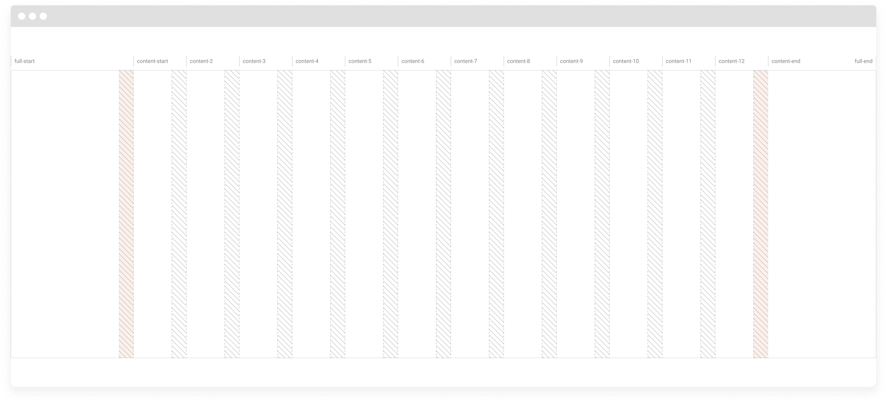
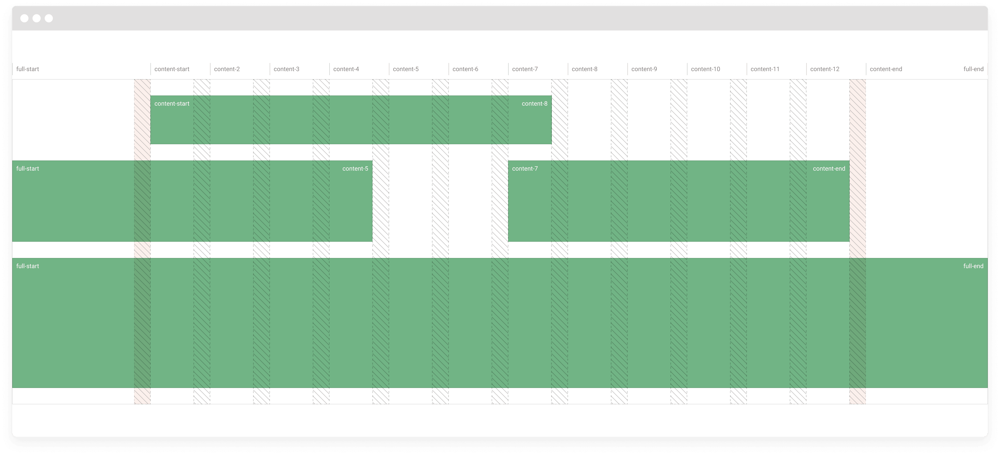
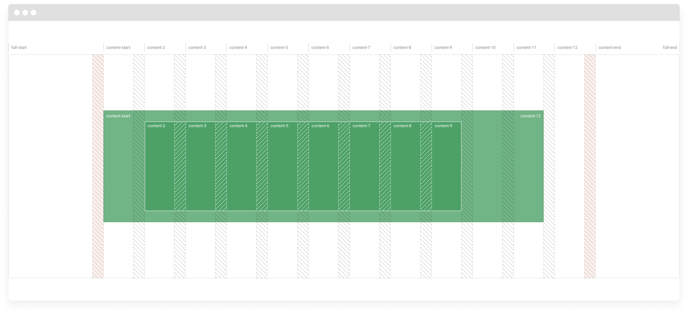
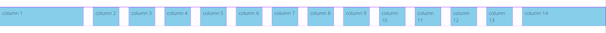
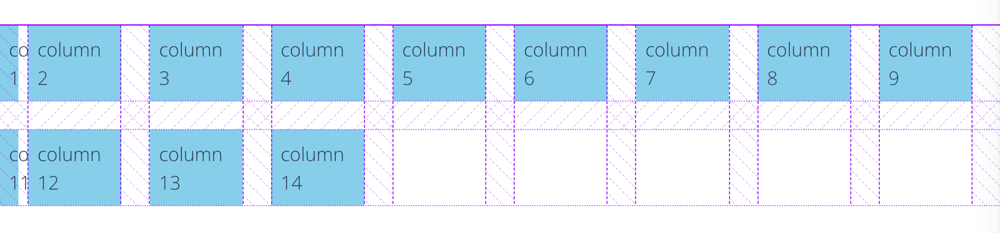
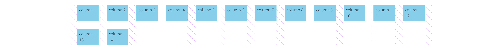

# 🤗 Human Universal Gridder (Hug)

A layout component by your friends at [Development Seed](https://developmentseed.org).

```bash
yarn add @devseed-ui/hug-chakra
```

- [🤗 Human Universal Gridder (Hug)](#-human-universal-gridder-hug)
  - [Nested Hug](#nested-hug)
  - [Configuring Hug](#configuring-hug)
  - [Usage details](#usage-details)
    - [Nested Hug needs to be a direct descendant of another Hug](#nested-hug-needs-to-be-a-direct-descendant-of-another-hug)
    - [Hug's `hugGrid` prop](#hugs-huggrid-prop)
    - [Contents inside Hug](#contents-inside-hug)
    - [Auto-placement of child items](#auto-placement-of-child-items)

The Human Universal Gridder (Hug) is a layout component with two main purposes:

1. Create a grid that remains centered on the page and has leading and trailing columns of varying size.
2. Handle subgrids when a Hug is nested within another Hug.



The image above shows the grid that gets created when a Hug is used. The number of columns varies according to the screen size, defaulting to:
- Small screens: 4 columns
- Medium screens: 8 columns
- Large screens: 12 columns

**Hug responsiveness in action:**  

https://user-images.githubusercontent.com/1090606/156192701-350da28a-7bf4-4129-a50b-303ca3a90304.mp4

<details>
  <summary>Code</summary>

```js
  <Hug height='15rem'>
    <Text
      py='5rem'
      overflow='hidden'
      align='center'
      bg='blanchedalmond'
      gridColumn='full-start/content-start'
    >
      Leading Column
    </Text>
    <Text
      py='5rem'
      overflow='hidden'
      align='center'
      bg='aliceblue'
      gridColumn='content-start/content-end'
    >
      Universal Gridder
    </Text>
    <Text
      py='5rem'
      overflow='hidden'
      align='center'
      bg='blanchedalmond'
      gridColumn='content-end/full-end'
    >
      Trailing Column
    </Text>
  </Hug>
```
</details>

As you can see from the video, the grid will always be centered on the page (with a maximum width bound to the theme property `config.hug.layoutMax`), the leading/trailing columns will take up the rest of the space and will shrink until they disappear.  
The centered grid will also always have a buffer from the side of the page which is something that does not exist in a traditional css grid.

This approach allows the creation of complex and interesting element placement. An example is a block that would be "bleeding" out of the page content (common with images).



The underlying tech of the Human Universal Gridder is a normal css grid, albeit one with some complex calculations.  
We're taking advantage of the ability of naming grid lines in css' `grid-template-columns`, to allow you to easily define start and end positions. Therefore whenever an element is placed inside a Hug you have to define the grid placement of this element using css: `grid-column: <start>/<end>`.

If you need a refresher on css grids check [Css Trick's A Complete Guide to Grid](https://css-tricks.com/snippets/css/complete-guide-grid/).

You have to use the actual line names with Hug as something like `span 2` will cause unexpected behaviors.  
You can check the [image at the beginning](./docs/media/grid.png) for a visual understanding of the grid lines, but here's the full list:
```
full-start
content-start
content-2
content-3
content-4
content-5
content-6
content-7
content-8
content-9
content-10
content-11
content-12
content-end
full-end
```

_**Note**: Even though the line name `content-1` does not exist, it is the same as `content-start`. We considered it a better expertience to have consistent start and end names for the content (`content-start`/`content-end`)._  

_**Caveat**: Lines `content-5` though `content-12` will exist depending on the media query. For example, for small screens you'll have `full-start`, `content-start`, `content-2`, `content-3`, `content-4`, `content-end`, `full-end`._

## Nested Hug

The beauty of the Hug really shines where they are nested.



Whenever you nest a Hug inside another, you also have to specify the grid placement, but instead of doing it with css, you must do it with a component prop (grid) and specify the grid position for the different media breakpoints. This is needed so that the subgrid calculations are done properly.  

A nested Hug will retain the same columns and spacing as its parent. For example, in the image above the element with a darker green, is placed in the grid lines `content-2` to `content-9`, and its grid is comprised of the subgrid with the same columns.

The available breakpoints are the ones defined in the Chakra UI theme, by default (`base | sm | md | lg | xl | 2xl`).

Example:
```jsx
<Hug>
  {/*
    This first element will start occupying the full grid (full-start/full-end),
    then at the md breakpoint will go from content-start to the end of the
    third column (grid line content-4), and on large screens will take up 3
    columns, from content-2 to content-5
  */}
  <Hug
    hugGrid={{
      // Below the sm breakpoint full-start/full-end (base) is used by default.
      sm: ['full-start', 'full-end'],
      md: ['content-start', 'content-4'],
      lg: ['content-2', 'content-5']
    }}
  >
    <p>Content</p>
  </Hug>
  <Hug
    hugGrid={{
      base: ['full-start', 'full-end'],
      // The md breakpoint is not defined, so the previous available one
      // (base here) is used until we reach the next one.
      lg: ['content-6', 'full-end']
    }}
  >
    <p>Content</p>
  </Hug>
  <Hug hugGrid={['full-start', 'full-end']}>
    <p>Always full-start/full-end</p>
  </Hug>
</Hug>
```

## Configuring Hug
The values used by HUG can be configured in the Chakra UI theme. Since they do not necessarily refer to css properties, they're under the `config` property of the theme.

The default values are:
```js
{
  layoutMax: 'container.xl',
  gaps: {
    base: '4',
    md: '8',
    lg: '12'
  },
  columns: {
    base: 4,
    md: 8,
    lg: 12
  }
}
```

To change them you can use the `extendHugConfig` function from HUG together with the `extendTheme` function from Chakra UI:
```js
import { extendTheme } from '@chakra-ui/react';
import { extendHugConfig } from '@devseed-ui/hug-chakra';

export default extendTheme({
  config: {
    ...extendHugConfig({
      layoutMax: 'container.2xl'
    })
  }
});
```

## Usage details

### Nested Hug needs to be a direct descendant of another Hug
Much like with css grids, an element can only be positioned in a grid if its parent has a grid.

```jsx
// ❌  Bad
<Hug>
  <div>
    <Hug></Hug>
  </div>
</Hug>

// ✅  Good
<Hug>
  <Hug>
    <div></div>
  </Hug>
</Hug>
```

### Hug's `hugGrid` prop
Hug should only use a `hugGrid` prop if it is a nested Hug. It uses the provided values to compute its grid in relation to the parent.  
The top level Hug does not need to compute anything in relation to a parent and therefore does not need a `hugGrid`.

```jsx
// ❌  Bad
<body>
  <Hug hugGrid={{ sm: ['content-start', 'content-end'] }}>
    <Hug hugGrid={{ sm: ['content-start', 'content-2'] }}></Hug>
  </Hug>
</body>

// ✅  Good
<body>
  <Hug>
    <Hug hugGrid={{ sm: ['content-start', 'content-2'] }}></Hug>
  </Hug>
</body>
```

### Contents inside Hug
Hug should be used as a structural layout element and not have inline elements as a direct descendants.  
After having a grid defined you should use a block element (`div`, `section`, etc) to position your content. Since Hug provides a grid, the positioning of these elements should be done with css as if it were a normal grid.

```jsx
// ❌  Bad
<Hug>
  <Hug hugGrid={{ sm: ['content-start', 'content-2'] }}>Some content</Hug>
  <Hug hugGrid={{ sm: ['content-2', 'content-4'] }}>More content</Hug>
</Hug>

// ✅  Good
// Using inline styles only for example purposes. Styling should be done with
// Chakra UI elements to account for media queries.
<Hug>
  <div style={{ gridColumn: 'content-start/content-2' }}>Some content</div>
  <div style={{ gridColumn: 'content-2/content-4' }}>More content</div>
</Hug>
```

A good rule of thumb to decide whether or not to nest Hug is to think if you need your content to have columns.  
For example if you need your content to start at the middle of the page with a background that starts at beginning you'd do something like:

```jsx
<Hug>
  <Hug
    hugGrid={{ lg: ['content-start', 'content-end'] }}
    style={{ background: 'red' }}
  >
    <div style={{ gridColumn: 'content-6/content-end' }}>Some content</div>
  </Hug>
</Hug>
```

The parent Hug provides the main grid. The nested Hug has the background, and the `div` child positions the content.

### Auto-placement of child items
The CSS Grid Layout specification contains rules that control what happens when you create a grid and do not specify a position for the child elements.  
The default behavior it to put an element inside each column, which means that when using a Hug with a grid `full-start/full-end` the fluid columns will also get an element.

The following code:
```jsx
// ❌  Bad
<Hug>
  {Array(14).fill(0).map((e, idx) => {
    return (
      <div style={{ backgroundColor: 'skyblue', padding: '.5rem' }}>
        column {idx + 1}
      </div>
    );
  })}
</Hug>
```

Will lead to this following result which looks good, but you probably want your auto-placed items to all have the same size:



However, this placement will become a problem when you screen size gets smaller:



This happens because, even though the fluid columns now have a size of 0 they are still columns and are not skipped.

The easiest way to fix this (while still using auto-placement) is to add a nested Hug, which only takes up the `content-start/content-end` grid:
```jsx
// ✅  Good
<Hug>
  <Hug hugGrid={{ base: ['content-start', 'content-end'] }}>
    {Array(14).fill(0).map((e, idx) => {
      return (
        <div style={{ backgroundColor: 'skyblue', padding: '.5rem' }}>
          column {idx + 1}
        </div>
      );
    })}
  </Hug>
</Hug>
```


